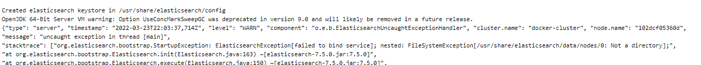
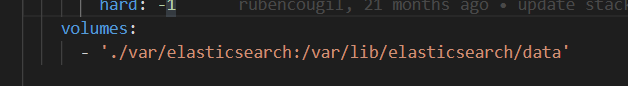

# Elastic Stack with Docker


## How to run the Stack

To initialize all the needed services.

```
docker-compose up -d
```

## para todos los servicios y borrar la red

```
docker-compose down
```

## How to run PHP sample app

Install needed PHP dependencies

```
cd app && composer install
```

Execute the PHP sample application

```
php app/php/app.php -a fo1 -b bar
```

## errores


### solución


https://stackoverflow.com/questions/59957542/can%C2%B4t-start-elasticsearch-docker-container

